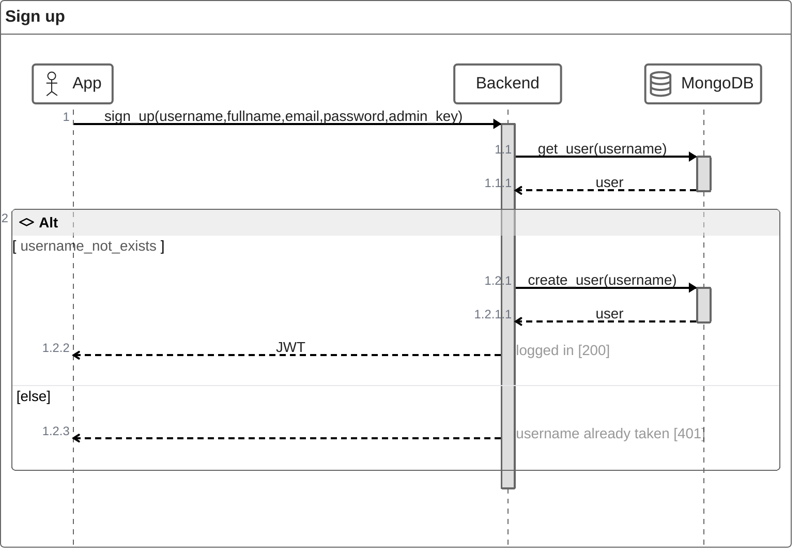
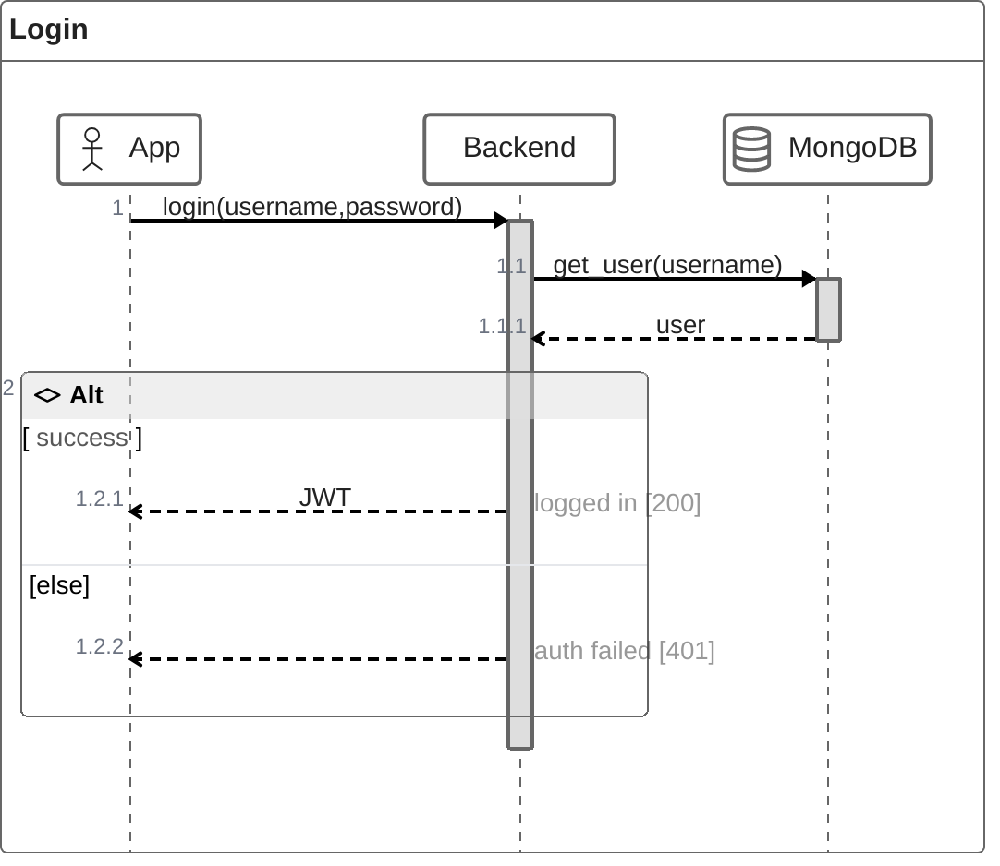
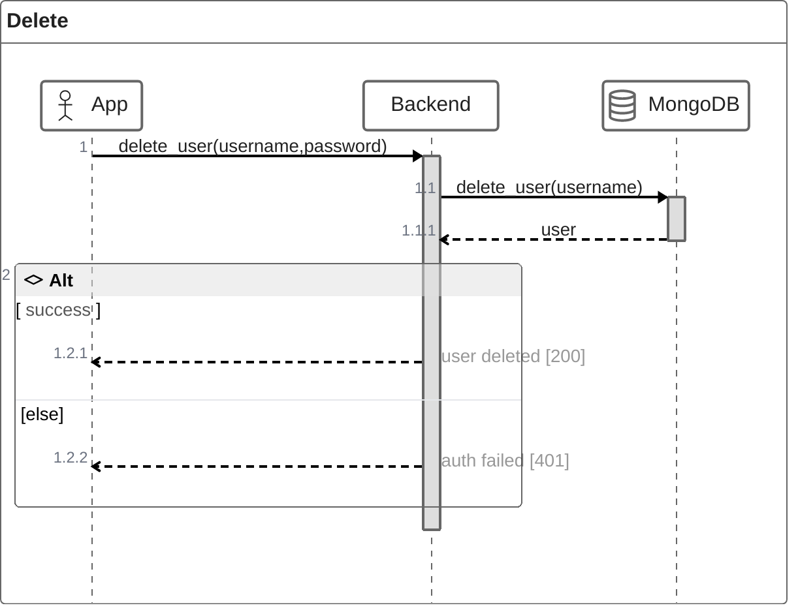

Die Authentifizierung wird über `JWT` geregelt.

# Create User
Für die Registrierung sind die angaben:
- username
- full name
- password
- email
- admin key
notwendig. 

`username` und `password` sind am wichtigsten, da über den `username` der benutzer eindeutig ist und das `password` den Account des users schützt.

`full name` hat nur die Funktion, um den Benutzer persönlich anreden zu können.

Der `admin key` wird genutzt, um zu verhindern, das sich unbefugte registieren können.

Die `email` hat bisher noch keinen Nutzen. Diese soll aber im späteren genutzt werden können, um das `password` zurückzusetzen.

# Login
Die Authentifizierung wird über `username` und `password` geregelt. Dabei wird der `username` in der collection `users` gesucht. Das gehashte `password` wird dekodiert und geprüft. Bei erfolgreicher Authentifizierung wird ein `JWT` zurückgegeben.

# Delete User
Um einen Account zu löschen sind `username` und `password` notwendig. Über `username` wird der zu löschende Account referenziert. Das `password` wird als Sicherheit genutzt, damit niemand unbefugtes den Account löschen kann.

Später soll dies ebenfalls über die `email` sichergestellt werden.

