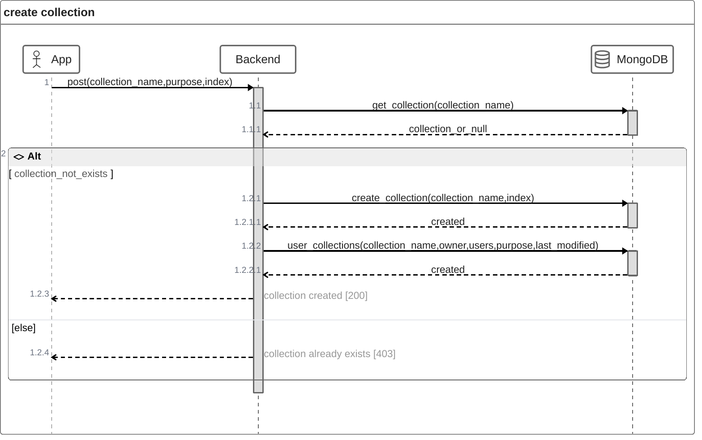

# Collections
Collections werden über `user_collections` verwaltet. Dabei wird der `name` der collection zusammen mitden folgenden Attributen gespeichert:
- `collection_id`: eindeutige Identifikationsnummer
- `purpose`: Grund oder Kategorie der Liste
- `owner`: user, dem die collection gehört
- `users`: alle, die auf die collection zugreifen können
- `index`: Ein optionaler Index, mit der die Abfrage der items effizienter gemacht werden kann (vgl. MongoDb indexes). Der Index wird immer mit `Ascending` erstellt.
- `timestamp`: Zeitpunkt der letzten Änderung in utc (zulu) nach `ISO 8601`

Der Datentyp wird `collection_info` genannt.

Jede collection ist eine eigenständige collection in der Datenbank, in der die Daten gespeichert werden. Der Zugriff erfolgt über die `collection_id`, die der name der collection in der Datenbank ist. 

## Collection erstellen
Beim erstellen einer Collection müssen folgende Attribute übergeben werden:
- `collection_name`: Der Name der der Collection
- `purpose`: Der Grund oder die Kategorie der Collection (z. B.: Tasks oder Notes)
- `index`: Ein optionales Feld für das effiziente Abfragen der items

Wenn die Collection erstellt wird, ist diese leer. Gleichzeitig wird in `user_collections` ein Eintrag für die neue Collection mit den Feldern `collection_name`, `owner`, `users`, `purpose` und `last_modified` erzeugt. Für `owner` und `users` wird der `username` des Benutzers eingefügt, der aus dem `JWT` ausgelesen wird. `last_modified` wird auf die aktuelle Zeit gesetzt. Dieses Feld wird bei jeder Änderung an der Collection aktualisiert.

## Collection löschen

## User zu Collection hinzufügen

## User aus Collection entfernen

## Item zu Collection hinzufügen

## Item aus Collection aktualisieren

## Item aus Collection entfernen

## Collection aller Änderungen
Für jede Collection wird eine weitere Collection für die vorgenommenen Änderungen an den items erstellt. Dabei wird bei jeder Änderung (*hinzufügen, ändern oder löschen eines items*) ein Eintrag für die Änderung erzeugt. Das Namenschema ist dabei "`collection_id`_events". Jede Änderung wird mit folgenden Feldern erstellt:
- `event`: "created", "edited" oder "removed"
- `item`: das erstellte, geänderte oder gelöschte item
- `timestamp`: string im utc format (zulu) nach `ISO 8601`

## Collection beobachten (Websockets)