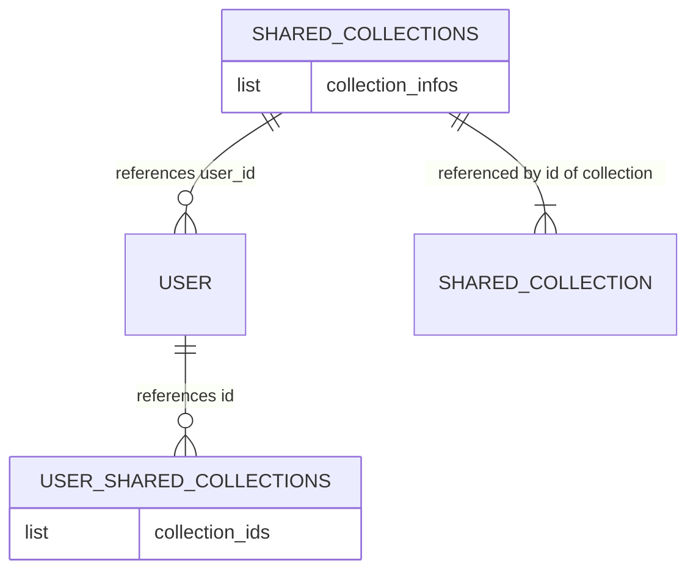
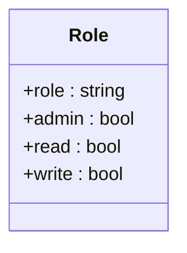
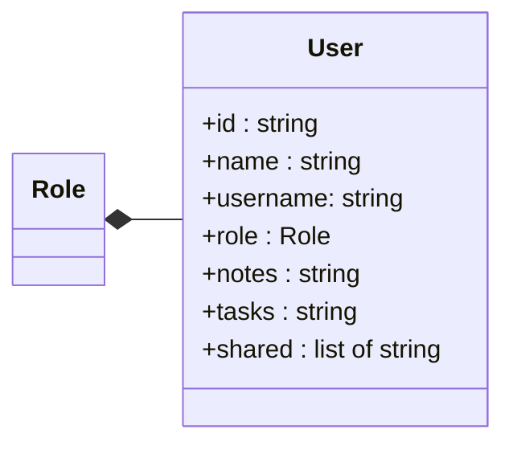
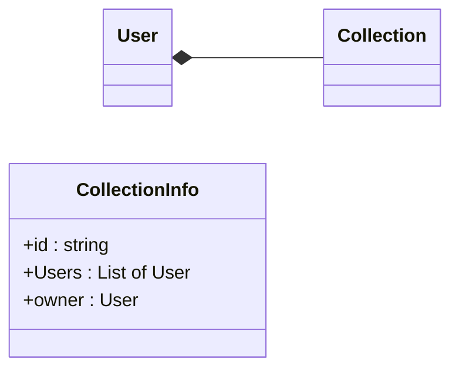
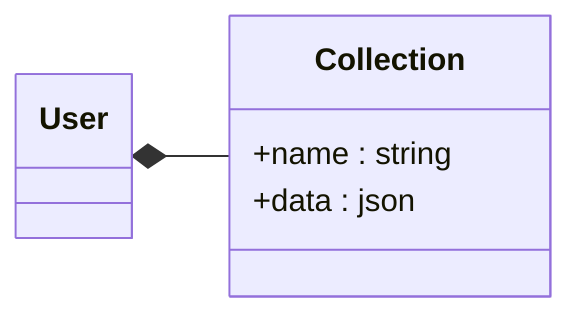

## ids für collections
- welches Verfahren
- wie lang?
- was für Zeichen?

## Namensschema

`id` _ `private-oder-shared` _ `Verwendungszweck`

**Bsp.:** 
- `0123abc456def_private_notes` -> private Notizen von user mit user id 
- `0123abc456def_private_tasks` -> private tasks von user mit user id 
- `0223abc456def_shared_tasks` -> geteilte tasks mit der id 

>[!important]
>alle privaten Collections beginnen mit der **user id** diese ist eindeutig dem user zugeordnet. Bei den geteilten Collections wird eine neue **id** erstellt und inter der privaten Liste des user gespeichert

## Collections Diagram

## Role
### Mögliche Rollen:
#### admin
##### permissions:
- verwalten
- lesen 
- schreiben
#### user
##### permissions:
- lesen
- schreiben

## User

## Collection Info

## Collection
Die Collection hat eine **id** als Namen. Die Informationen zu Benutzer und Eigentümer Anzu

## Collection erstellen

## Collection löschen

## Collection entfernen

## Item zu Collection hinzufügen

## Item aus Collection aktualisieren

## Item aus Collection entfernen