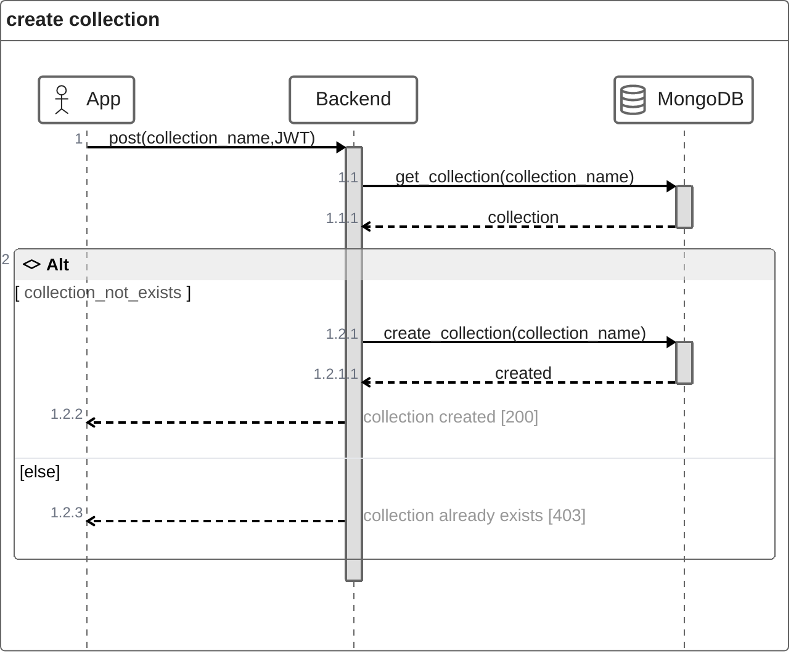

# Create Collection

```mermaid
zenuml
    title create collection
    @Actor App
    @ElasticBeanTalk Backend
    @Database MongoDB

    App->Backend.post(collection_name, JWT) {
        Backend->MongoDB.get_collection(collection_name) {
            return collection
        }

        if(collection_not_exists) {
            Backend->MongoDB.create_collection(collection_name){
                return created
            }

            // collection created [200]
            return
        }
        else {
            // collection already exists [403]
            return 
        }
    }
```