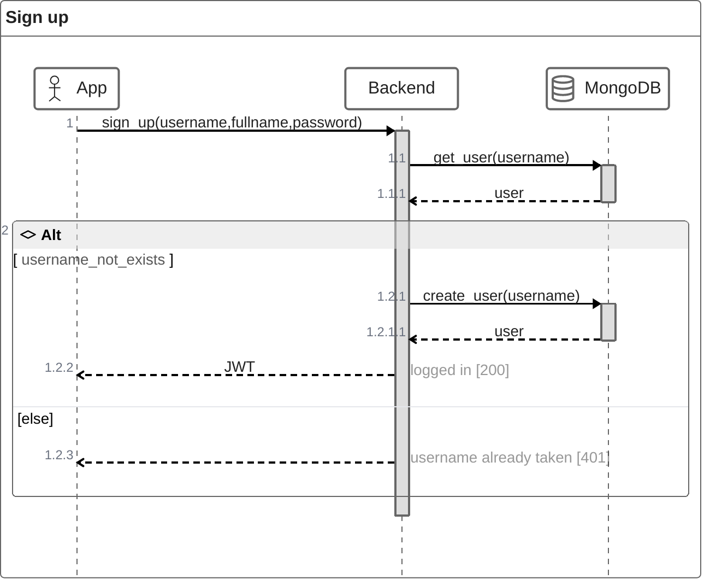
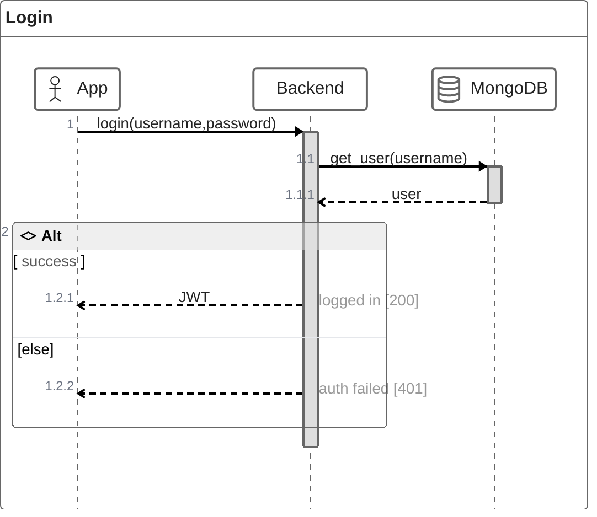
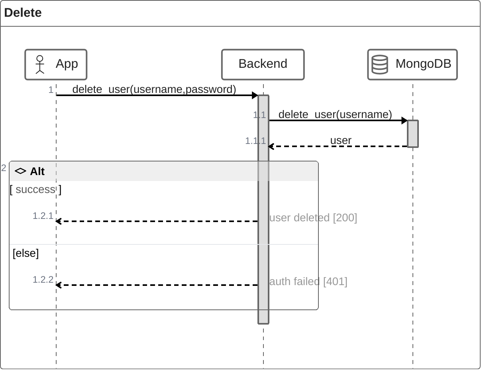

# Create User

```mermaid
zenuml
    title Sign up
    @Actor App
    @ElasticBeanTalk Backend
    @Database MongoDB
    App->Backend.sign_up(username, fullname, password) {
        Backend->MongoDB.get_user(username) {
            return user
        }

        if(username_not_exists) {
            Backend->MongoDB.create_user(username) {
                return user
            }
            // logged in [200]
            return JWT
        }
        else {
            // username already taken [401]
            return 
        }
    }
```

# Login

```mermaid
zenuml
    title Login
    @Actor App
    @ElasticBeanTalk Backend
    @Database MongoDB
    App->Backend.login(username, password) {
        Backend->MongoDB.get_user(username) {
            return user
        }
        if(success) {
            // logged in [200]
            return JWT
        }
        else {
            // auth failed [401]
            return
        }    
    }
```

# Delete User

```mermaid
zenuml
    title Delete
    @Actor App
    @ElasticBeanTalk Backend
    @Database MongoDB
    App->Backend.delete_user(username, password) {
        Backend->MongoDB.delete_user(username) {
            return user
        }
        if(success) {
            // user deleted [200]
            return
        }
        else {
            // auth failed [401]
            return
        }    
    }
```
