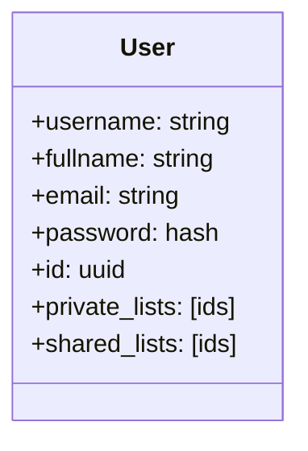
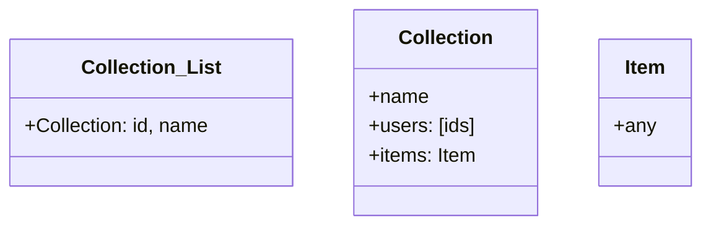

# User

```mermaid
classDiagram
    class User{
        +username: string
        +fullname: string
        +email: string
        +password: hash
        +id: uuid
        +private_lists: [ids]
        +shared_lists: [ids]
    }
```

# Collections

```mermaid
classDiagram
    class Collection_List{
        +Collection: id, name
    }

    class Collection{
        +name
        +users: [ids]
        +items: Item
    }

    class Item{
        +any
    }

```