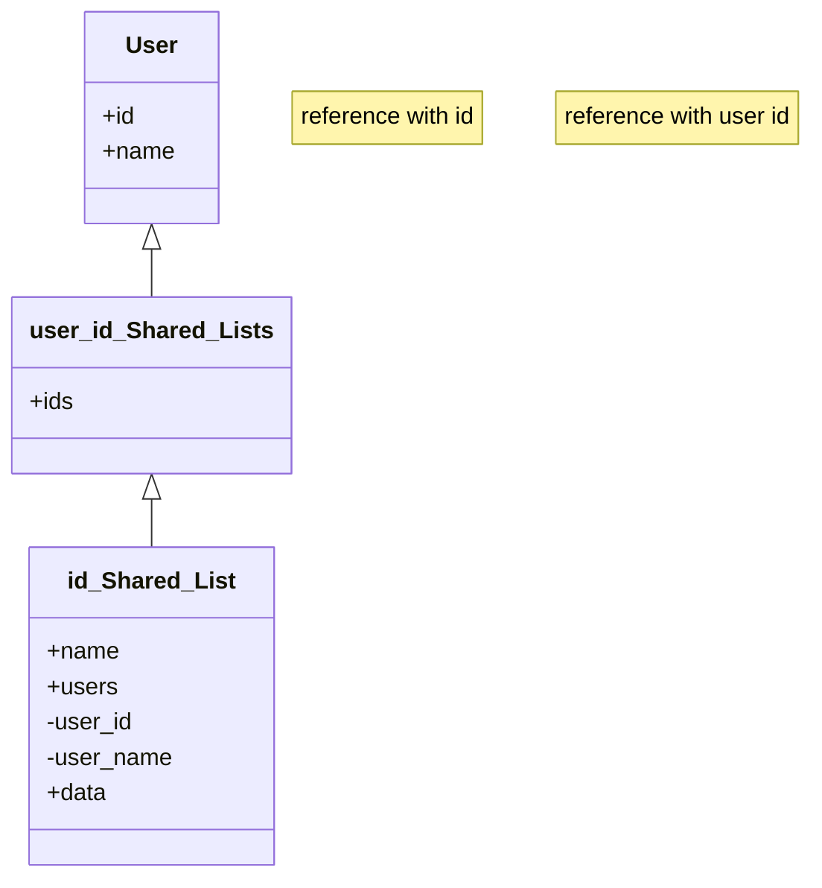
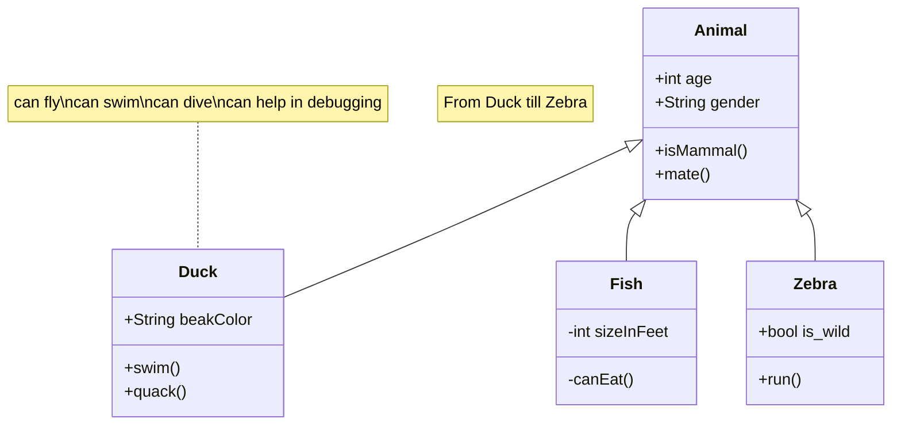

# Geteilte Listen

```mermaid
classDiagram
    class User{
        +id
        +name
    }
    class user_id_Shared_Lists{
        +ids
    }
    class id_Shared_List{
	    +name
	    +users
	    -user_id
	    -user_name
        +data
    }
    note "reference with id"
    user_id_Shared_Lists <|-- id_Shared_List
    note "reference with user id"
    User <|-- user_id_Shared_Lists
```

# Private Listen

```mermaid
classDiagram
    note "From Duck till Zebra"
    Animal <|-- Duck
    note for Duck "can fly\ncan swim\ncan dive\ncan help in debugging"
    Animal <|-- Fish
    Animal <|-- Zebra
    Animal : +int age
    Animal : +String gender
    Animal: +isMammal()
    Animal: +mate()
    class Duck{
        +String beakColor
        +swim()
        +quack()
    }
    class Fish{
        -int sizeInFeet
        -canEat()
    }
    class Zebra{
        +bool is_wild
        +run()
    }
```
